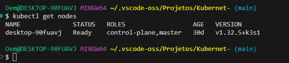
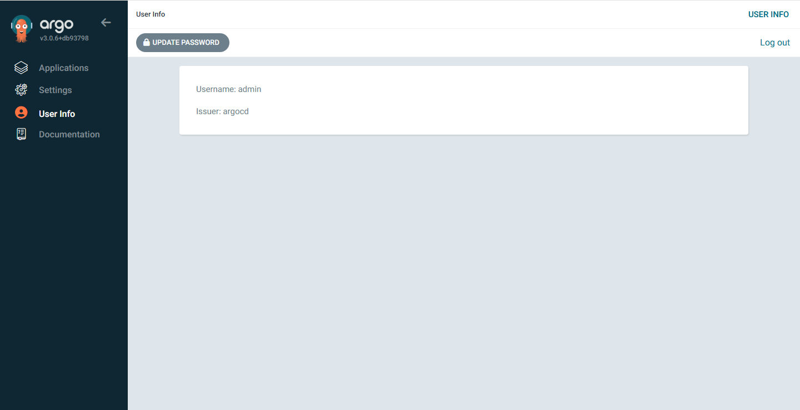
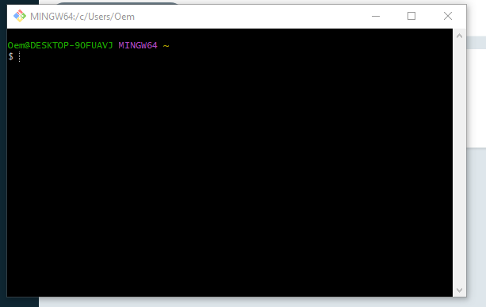
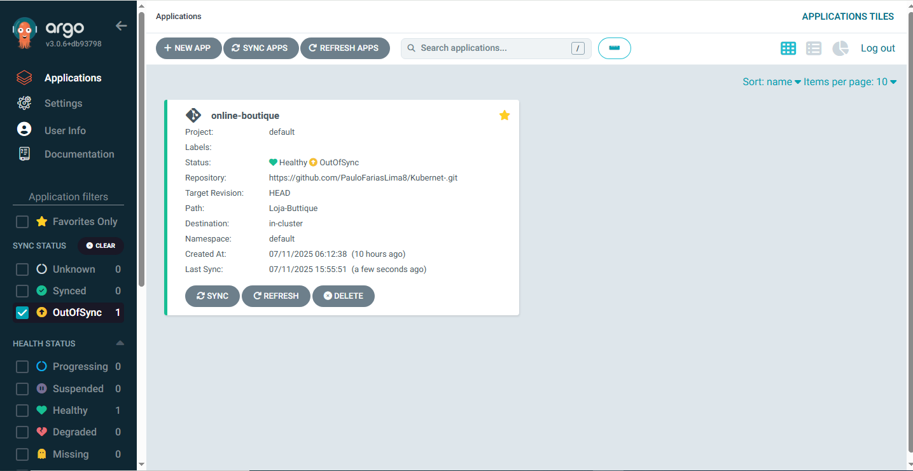
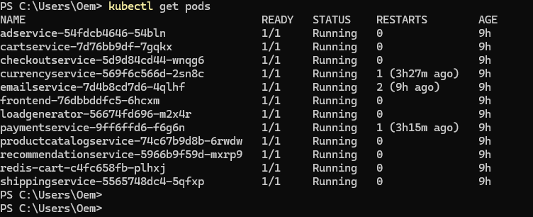
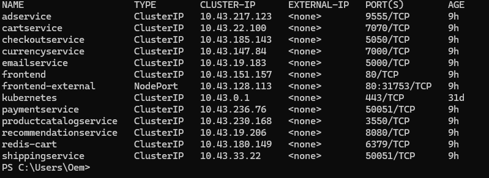
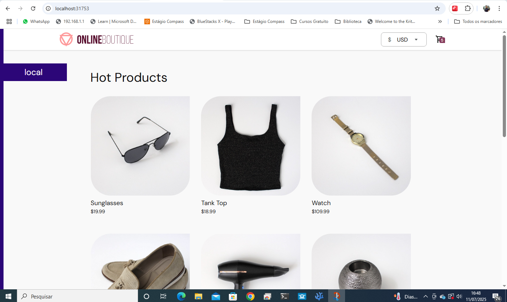

<<<<<<< HEAD
# Projeto de Kubernet Compass Uol
=======
# Projeto Kubernet e GitOps
>>>>>>> 2a85da9 (Versão final rmd)
Projeto de Kubernet Compass Uol

## Objetivo: 
- Executar um conjunto de microserviços (Online Boutique) em Kubernetes 
local usando Rancher Desktop, controlado por GitOps com ArgoCD, a partir de 
um repositório público no GitHub.
O microserviço usado aqui está disponível no seguinte url: 
https://github.com/GoogleCloudPlatform/microservices-demo

## Pre-requesitos: 

- Rancher Desktop instalado (com Kubernetes habilitado);
- Kubectl configurado (kubectl get nodes funcionando);
- ArgoCD instalado no cluster;
- Conta no GitHub com repositório público;
- Git instalado;
- Docker funcionando localmente.

## Instalando os Programas 

#### *Rancher Desktop*

- Para Windows: Clique no linque a seguir baixe o instalador para Windows e prossiga com a instalação.
<p> URL:
https://rancherdesktop.io/ 

- Para Linux: Leia a documentação no link disponivel abaixo e prossiga com a instalação de acordo com sua distribuição linux.
<p>
Url: https://docs.rancherdesktop.io/getting-started/installation/#linux
<p>
Depois de instalado o RancherDesktop ative o WSL - Windows Subsystem for Linux, para poder usar e instalar o Kubernet no Rancher. 
<p>

- ### *Para habilitar o Kubernet*
 1. Passo: Clique no Rancher;
 2. Passo: Vá em Preferencias;
 3. Paaso: Clique em Kubernet;
 4. Passo: habilite o Kubernet.

 Se tudo tiver ok com a instalação do Kubernet:

 ```kubectl get nodes```
 Digite o camando acima no terminal de sua preferencia, asaida deve ser algo semelhante a imagem abaixo. 
 

#### *ArgoCD*
- Para instalar o ArgoCD no cluster Kubernetes, execute os seguintes comandos no terminal:

```bash kubectl create namespace argocd 
kubectl apply -n argocd -f
 https://raw.githubusercontent.com/argoproj/argo￾cd/stable/manifests/install.yaml
```
- Após a instalação, exponha o serviço do ArgoCD para acesso externo:

```bash 
kubectl port-forward svc/argocd-server -n argocd 8080:443
```
- Acesse a interface web do ArgoCD em `http://localhost:8080` e faça login com as credenciais padrão:
  - Usuário: `admin`
  - Senha: A senha pode ser obtida com o comando:
  
```bash 
kubectl -n argocd get secret argocd-initial-admin-secret -o jsonpath="{.data.password}" | base64 -d; echo
```
Depois de acessar o programa recomendasse mudar a senha em: 

- User Info > UPDATE Password. 

## Conta no GitHub
 Com os arquivos yaml no github o ArgoCD vai fazer a sincronia e enviar qualquer alteração que seja feita para o Custle local da aplicação. <p>
 1. Passo: Criar o Repositório;
 2. Passo: Criar a pasta  "Loja-Butique", no projeto foi sugerido K8s.

 ## Instalando o Git.
 Caso não tenha o Git instalado, siga o passo a passo abaixo.
 <p>

#### **No Linux**

1. Abra o terminal.
2. Execute o comando abaixo conforme sua distribuição:

- **Debian/Ubuntu:**
  ```bash
  sudo apt update
  sudo apt install git
  ```

- **Fedora:**
  ```bash
  sudo dnf install git
  ```

- **CentOS/RHEL:**
  ```bash
  sudo yum install git
  ```

3. Verifique a instalação:
   ```bash
   git --version
   ```

#### **No Windows**

1. Acesse o site oficial: [https://git-scm.com/download/win](https://git-scm.com/download/win)
2. Baixe o instalador e execute-o.
3. Siga as instruções do assistente de instalação.
4. Após instalar, abra o Prompt de Comando e verifique:
   ```cmd
   git --version
   ```
   Depois de instalado, abra o Git: 
   
   No terminal que abril, digite os comandos abaixo para criar seu usurio local.
  ```bash
  git config --global user.name "Seu Nome"
  git config --global user.email "seu@email.com"
  ```
  Esses comandos configuram seu nome e e-mail, que serão usados em todos os commits feitos a partir deste computador. Para verificar se as configurações foram aplicadas corretamente, execute:

  ```bash
  git config --global --list
  ```
# Fork dos Arquivos da Loja Butique

1. Passo: acesse o link abaixo
https://github.com/GoogleCloudPlatform/microservices-demo
<p>

 2. Passo: copie o aquivo de release/kubernetes-manifests.yaml;
 3. Passo: coloque o arquivo na Pasta Loja-Buttique que foi criada;
 4. Passo: Salve o arquivo em sua pasta local no pc. 

 # Craiando o App de Sicronia no ArgoCD
 Acesse novamente o ArgoCD.
 1. Passo: em Applications clica em NEW APP.
 2. Passo: Preencha assim:

Name: online-boutique

Project: default

Sync Policy: Automatic

Configuração do repositório: 

Repository URL: https://github.com/PauloFariasLima8/Kubernet-.git

Revision: HEAD

Path: Loja-Buttique

Configuração de destino:

Cluster URL: https://kubernetes.default.svc

Namespace: default

3. Passo: Clique em Create.

Apos isso seu app deve iniciar a sincronia do seu GitOps. 
Obsever a imagem abaixo.


## Acessando a LojaButique.
Abra o terminal de sua escolha na pasta local em que salvou o arquivo YAML kubernetes-manifests.yaml, no meu caso, arquivo que salvei é loja-frontEnd.yaml.

1. Passo: com o terminal aberto na respectiva pasta, digite o seguinte comando: 
 ```Bash 
 kubectl apply -f kubernetes-manifests.yaml
 ```
 Ao final será criado algo entorno de 11 pods. 

 2. Passo: Para verificar os pods, digite o seguinte comando:

 ``` Bash 
 kubectl get pods
 ```
 O resultado deve ser igual ao da imagem a seguir.
 

 3. Passo: Acessando o FrontEnd da LojaButique, digite o seguinte comando no terminal:

 ``` Bash 
 kubectl get svc 
 ```
 A saida deve ser igual a imagem abaixo.
 
 O Pod que vamos acessar é o *frontend-external* em Type ele deve aparecer como LoadBalancer, se tentarmos acessa-lo de forma direta não será liberado a acesso. Para liberar o acesso digite o comando abaixo:
 ```Bash 
 kubectl port-forward svc/frontend 8080:80
 ``` 
Agora já podemos acessar o FrontEnd via navegador digitando na barra de endereço o: localhost:80, no meu caso a porta escolida foi a 31753.
A saida deve ser igual a imagem abaixo:



